# World Cup 2026 Football Analytics

An end-to-end football analytics research project built from local StatsBomb
Open Data. The repository turns event-level JSON into validated team-season
datasets, spatial Expected Threat (xT) features, clustering experiments,
formation summaries, custom expected-goals (xG) models, and documented match
prediction case studies.

This is a portfolio research project, not a live forecasting service. The
prediction notebooks use historical proxy data rather than current 2026 event
data, confirmed lineups, injuries, or betting markets.

## Start Here

| If you want to review... | Open... | What it demonstrates |
| --- | --- | --- |
| The data pipeline | [`06_build_team_season_xt_matrices.ipynb`](06_build_team_season_xt_matrices.ipynb) | Local JSON ingestion, schema checks, validation, feature engineering, and reproducible exports |
| The main experiments | [`07A_clustering_raw_xt_matrix.ipynb`](07A_clustering_raw_xt_matrix.ipynb), [`07B_clustering_smoothed_xt_matrix.ipynb`](07B_clustering_smoothed_xt_matrix.ipynb), [`07C_clustering_multichannel_xt_features.ipynb`](07C_clustering_multichannel_xt_features.ipynb) | PCA, KMeans, metric comparison, cluster interpretation, and robustness analysis |
| A reusable Python module | [`formation_analysis.py`](formation_analysis.py) | Defensive JSON parsing, score validation, aggregation, logging, and report generation |
| Custom xG modeling | [`12_train_custom_xg_compare_spain_france.ipynb`](12_train_custom_xg_compare_spain_france.ipynb) | Leakage-aware grouped splitting, model evaluation, calibration, and benchmark comparison |
| A complete case study | [`10_predict_spain_vs_france_world_cup_semifinal.ipynb`](10_predict_spain_vs_france_world_cup_semifinal.ipynb) | Integration of xT style, formation evidence, transparent assumptions, and written interpretation |
| Repository navigation | [`docs/PROJECT_STRUCTURE.md`](docs/PROJECT_STRUCTURE.md) | Inputs, outputs, execution order, and file responsibilities |
| The formal project report | [`docs/world-cup-2026-experiment-report.docx`](docs/world-cup-2026-experiment-report.docx) | Hypotheses, methods, results, limitations, decisions, and next steps |

## Research Questions

The repository investigates four connected questions:

1. Can event-level actions be converted into comparable team-season spatial xT
   profiles?
2. How do raw, smoothed, and multi-channel feature representations affect
   unsupervised tactical clusters?
3. Can historical xT, formation, and xG evidence support transparent match
   prediction experiments?
4. Which conclusions remain credible after accounting for sample quality,
   leakage risk, model assumptions, and missing current-tournament data?

## Data Workflow

```mermaid
flowchart LR
    A["Local StatsBomb JSON"] --> B["Schema and quality checks"]
    B --> C["Global xT model"]
    C --> D["Action-level xT"]
    D --> E["Team-season matrices"]
    E --> F["Raw / smoothed / multi-channel features"]
    F --> G["PCA + KMeans experiments"]
    G --> H["Centroids, representatives, and metrics"]
    H --> I["Documented prediction case studies"]
```



The xT pipeline trains one global value model so every team-season is evaluated
on the same scale. Machine-learning inputs are numerical 16 x 12 pitch
matrices; rendered heatmaps are interpretation artifacts, not model features.

## Dataset and Validation Evidence

The saved build log records the following completed run:

- 3,961 event files found and scanned in each pipeline pass
- 0 missing event files
- 0 parsing errors
- 101,221 shots and 11,324 goals used in global xT estimation
- 5,680,336 successful moves used in feature construction
- 922 team-season rows produced
- 413 columns in the combined clustering dataset

The clustering notebooks apply additional quality filters. The recorded
experiments begin with 922 team-season rows, remove 633 rows below the match
count threshold and one zero-sum row, and analyze 288 rows with no missing
feature values.

Raw data are stored locally under `archive/data/` using the StatsBomb Open Data
JSON structure. Generated CSV files are intentionally ignored by Git because
they can be rebuilt; selected visualizations and human-readable reports are
kept under `outputs/`.

## Experiment Design

Each clustering experiment standardizes its feature matrix, uses PCA to retain
approximately 85% of explained variance, evaluates KMeans candidates from
`k = 3` through `k = 10`, and saves labels, centroids, cluster summaries,
representative team-seasons, metric tables, and plots.

| Experiment | Representation | Samples | Features | PCA components | Variance retained | Silhouette at k=5 | Calinski-Harabasz | Davies-Bouldin |
| --- | --- | ---: | ---: | ---: | ---: | ---: | ---: | ---: |
| A | Created positive xT by start zone | 288 | 192 | 75 | 0.8527 | 0.0296 | 10.2786 | 2.3701 |
| B | Smoothed created xT representation | 288 | 192 | 75 | 0.8527 | 0.0296 | 10.2786 | 2.3701 |
| C | Created and received xT channels | 288 | 384 | 91 | 0.8515 | 0.0436 | 14.7739 | 2.4003 |

### What the saved results support

- Experiments A and B produced identical assignments for all 288 overlapping
  rows (`ARI = 1.0`, `NMI = 1.0`). The recorded smoothing run therefore did not
  create a distinguishable clustering result.
- Experiment C changed the grouping structure (`ARI = 0.3783`,
  `NMI = 0.4379` versus A and B). Its `k = 5` silhouette and
  Calinski-Harabasz scores improved, while its Davies-Bouldin score worsened
  slightly.
- The strongest silhouette among the evaluated candidates occurs at `k = 3`,
  not the configured final `k = 5`, for both the single-channel and
  multi-channel runs.
- The final `k = 5` solutions include singleton clusters. Cluster labels should
  therefore be treated as exploratory hypotheses, not stable tactical truths.

## Feature Definitions

The pitch is divided into a 16 x 12 grid:

`16 length bins x 12 width bins = 192 zones`

Zone indexing follows:

`zone = y_bin * 16 + x_bin`

The main feature families are:

- created positive xT by action start zone
- received positive xT by action end zone
- pass-created positive xT by start zone
- carry-created positive xT by start zone
- action-count distribution by start zone

The completed multi-channel run detected the created and received xT channels,
producing 384 features.

## Additional Analyses

### Formation matchup analysis

[`formation_analysis.py`](formation_analysis.py) scans StatsBomb-style event
files, extracts starting formations and tactical shifts, infers scores,
reconciles them with optional match metadata, and creates descriptive matchup
summaries. The module logs unreadable files and validation mismatches instead
of silently failing.

The results are descriptive rather than causal: team quality, competition,
opposition, era, and match state can all confound apparent formation effects.

### Custom xG experiments

The custom xG notebooks build shot features from local JSON, exclude penalty
shootouts from the main analysis, keep match IDs grouped across train/test
splits, and compare a histogram gradient boosting model with the provided
StatsBomb xG benchmark.

For the Spain-France comparison, the saved test metrics were:

| Model | Test shots | Log loss | Brier score | ROC AUC |
| --- | ---: | ---: | ---: | ---: |
| Custom HistGradientBoosting xG | 1,354 | 0.2496 | 0.0717 | 0.8281 |
| StatsBomb-provided xG | 1,354 | 0.2362 | 0.0670 | 0.8445 |

The benchmark performed better on all three reported metrics. The custom model
is retained as an educational, auditable comparison rather than presented as a
replacement.

### Match prediction case studies

The notebooks numbered 10 through 16 combine historical xT, xG, and formation
evidence for Spain-France, Argentina-England, and Argentina-Spain examples.
Every written report records the data proxies and explicitly limits its claims.
These outputs are demonstrations of analytical integration and communication,
not betting advice.

## Repository Layout

```text
.
|-- 05_... to 16_...ipynb       # Ordered research and prediction notebooks
|-- formation_analysis.py        # Reusable formation-analysis module
|-- notebooks/                   # Focused formation notebooks
|-- Learning/                    # Exploratory and learning notebooks
|-- outputs/                     # Generated tables, plots, and written reports
|-- archive/data/                # Local StatsBomb Open Data
|-- Reference and articles/      # Local research references
|-- docs/                        # Repository guide and formal report
|-- requirements.txt             # Python dependencies used by tracked analyses
`-- README.md                    # Project overview and review path
```

See [`docs/PROJECT_STRUCTURE.md`](docs/PROJECT_STRUCTURE.md) for a detailed data
and artifact catalog.

## Setup

Python 3.10 or newer is recommended.

```bash
python -m venv .venv
```

Activate the environment:

```powershell
.\.venv\Scripts\Activate.ps1
```

Install dependencies:

```bash
python -m pip install -r requirements.txt
```

The notebooks expect the local StatsBomb structure under `archive/data/`.
Several notebooks process thousands of JSON files and may take multiple
minutes. They write generated tables to `outputs/`.

## Reproduction Order

For the main xT experiment, run:

1. [`05_team_xt_surface_visualization.ipynb`](05_team_xt_surface_visualization.ipynb)
   for spatial data inspection and visualization.
2. [`06_build_team_season_xt_matrices.ipynb`](06_build_team_season_xt_matrices.ipynb)
   to build the global xT model and team-season feature catalog.
3. [`07A_clustering_raw_xt_matrix.ipynb`](07A_clustering_raw_xt_matrix.ipynb)
   for the interpretable raw baseline.
4. [`07B_clustering_smoothed_xt_matrix.ipynb`](07B_clustering_smoothed_xt_matrix.ipynb)
   for the smoothing comparison.
5. [`07C_clustering_multichannel_xt_features.ipynb`](07C_clustering_multichannel_xt_features.ipynb)
   for the created/received xT extension.

Prediction notebooks consume these saved artifacts and should be treated as
downstream case studies.

## Responsible Interpretation

xT spatial features describe where possession actions create threat. They do
not directly measure pressing, defensive intensity, block height,
counterpressing, injuries, player availability, goalkeeper quality, or current
form. Safer cluster descriptions refer to observed spatial patterns—such as
wide creation, central creation, or attacking-third concentration—rather than
asserting complete tactical identities.

The repository deliberately preserves weak or mixed results. Identical A/B
clusters, low `k = 5` silhouette values, singleton clusters, proxy data, and
benchmark underperformance are part of the analysis and should inform the next
iteration.

## Data Attribution

Data source: StatsBomb Open Data. See [`archive/README.md`](archive/README.md)
for the included terms, directory format, and attribution guidance.
